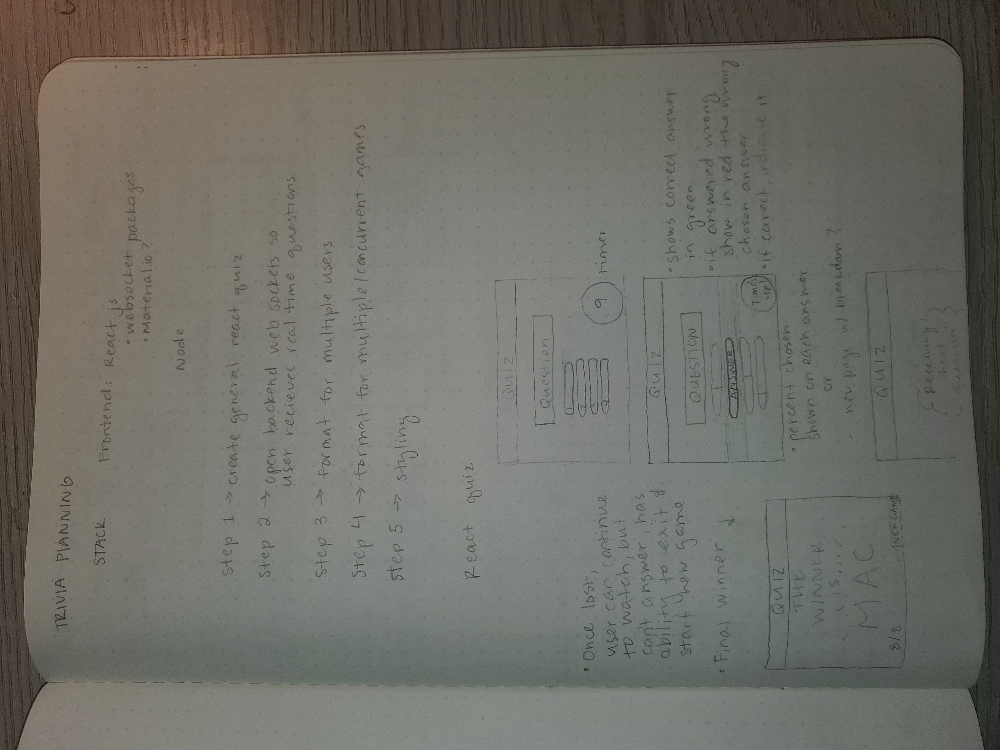
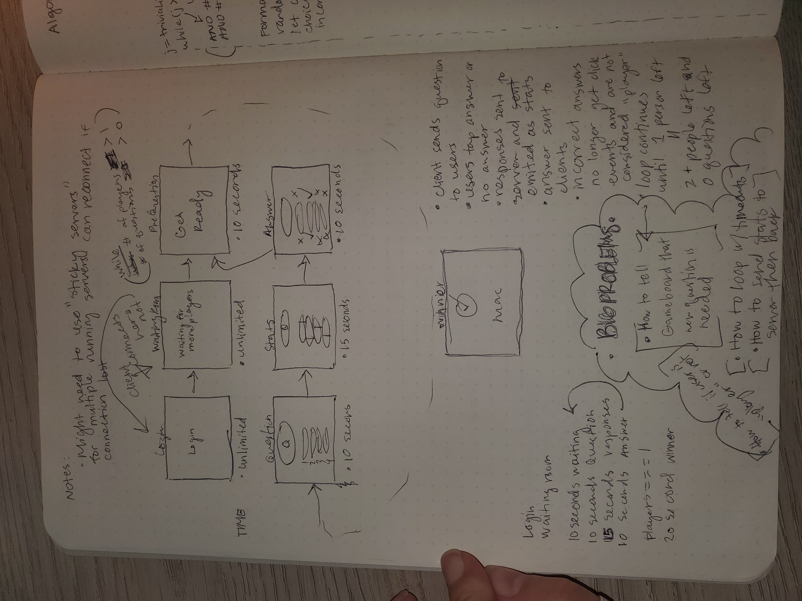
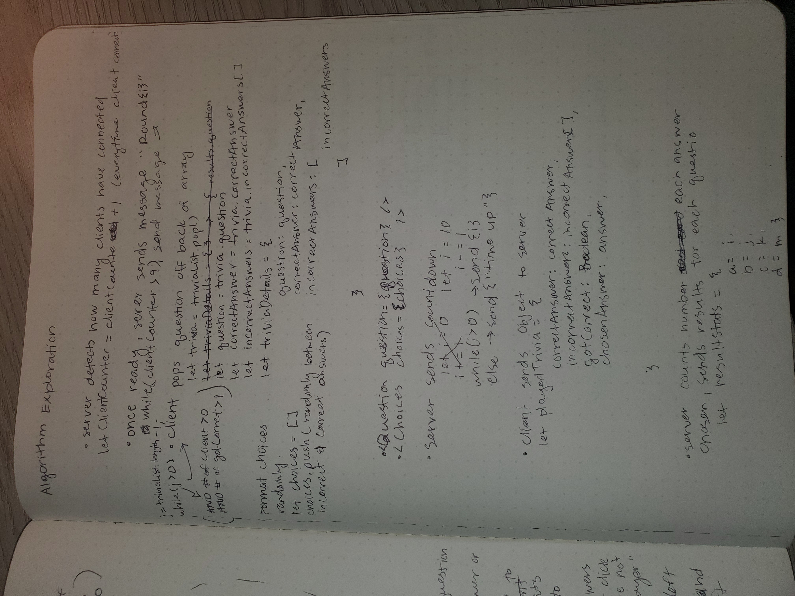
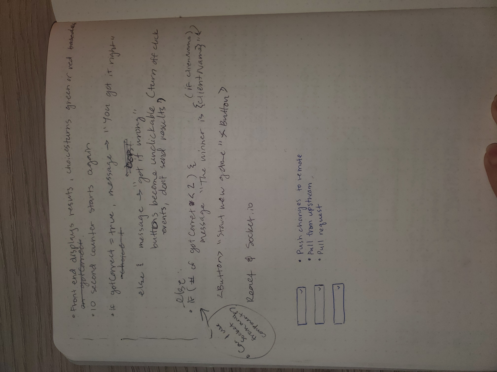
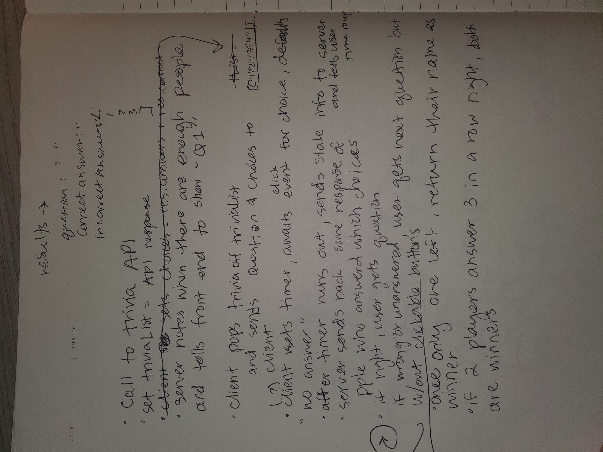
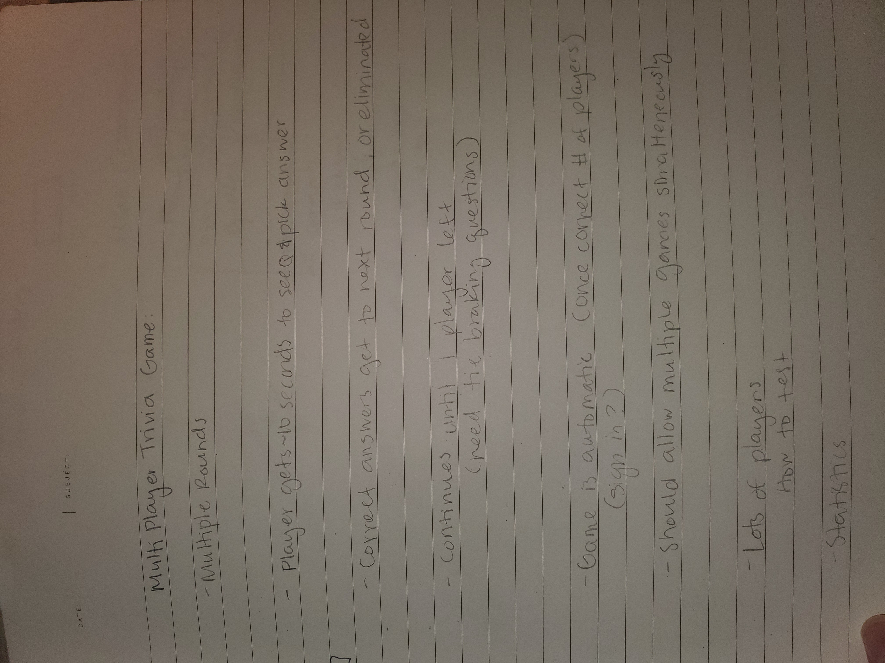

# Trivia_Game
An HQ Trivia style game to play with friends, family, and people all over the world

## Project Planning
### Stack
Node/Express app with a React front-end
Sockets.io

## Initial Steps
1. npx create-react-app 
2. Create landing page with game loading screen
3. Use react hooks to develope quiz components and winning/losing pages

4. node init
5. Create express app
6. Implement websockets so multiple clients can communicate with the server
7. Test socket connections

8. Deal with responsed from users and return solutions
9. Build stats that return to users after answer given

## Restart Initiated
After making it through steps 1-7 of initial setup, I discovered the conflicting processes of sockets and react. After trying everything I could think of, as well as reaching out to colleagues (without success as no one I know has tried to use React with sockets) I have decided to start again with a more common stack for sockets: Express/Node backend, with simple HTML, CSS, and JavaScript in the front end.

### Restart Steps
1. npm init to create node application
2. touch index.html and style.css, put together similar boilerplate and styling like the previously attempted trivia game
3. Convert/translate backend express app to single index.js, install node version of socket.io
4. Convert/translate frontend from react into vanilla Js, getting caught up to previous attempt's progress 
#### Note: Had an issue after pushing to repo and moving files, something I could not locate was corrupted in my code, giving me additional, unexpected output. Created new git repo, and new node project with the same file system and prepushed code, then pushed to new rep.
5. Now that many users can get the same question and send different answers successfuly, my next step is to return stats info from backend on which answers user chose.
6. Deal with correct vs incorrect answers
7. Change single round game into looping game that runs as long as there is more than 1 player (a connected client that has gotten all answers correct) and there are more that 0 trivia questions left. As well as create pause before game begins/not on reload of page/when enough people enter a room.

8. Add landing page/sign-in form to get user's names
9. Research sessions/tokens for allowing multiple games to run concurrently
10. Add additional categories for clients to choose from

11. Add restart/return to landing screen

#### Note: I feel like I really have come to understand how to manipulate sockets. At first I did not understand that informational differences between users must live on the front end, while uniformity in information must be delivered from the backend. 

### Project Recap:

After an unsuccessful, 5-6 day attempt at using Socket.io in React.js, and a lot of googling, I decided to switch gears and use vanilla JS on the frontend with simple HTML and CSS. I was hoping to have time to translate the project into python before turning it in, but between work and volunteer work I didn't get the chance. 
Working with Express on the back-end and JS on the front proved to be a much more direct way of completing the tasks. Where react rerenders often enough to create unexpected behavior with socket.io, plain Javascript communicates with the backend cleanly and (usually) only when I tell it to. That being said, I did run into quite a few async issues as well as over- and under-firing once I moved the project into a looping game rather than just one round. This created a significant issue with the statistics aspect of the game. I have gotten the Stats to show correctly at different stages of development, but the final version is unfortuneately lacking in that area. In hindsight, I wouldn't have spent so many hours of my time dealing with the stats before adding the game to the loop, as all the work I did was lost. 
I have pinpointed the issue but I cannot find a solution with my research. Whichever client joins the game last, is the only client's answer that is received by the server. I believe this is a server issue, as the front end manages correct and incorrect answers as it should.

Another significant issue that I have yet to find a solution for, is how to remove a room (or simply make it inaccessible to other clients) once a game has begun. I tried removing the option via DOM manipulation, but quickly realized I could not access the landing page HTML file once I had switched to the game.HTML file. And I also could not access it via the backend, which would have had the most authority to make that change since front end changes only really apply to individual clients, rather than all. In other words, removing the room 'History' as an option in the login page from the client side, might have only removed it for one user. I am still looking into a way to solve this problem.

I enjoyed learning about socket.io and discovering the many ways it works well, and also some of its disadvantages. I would like to continue working on the two issues I have had to leave unfinished during this window, in my own time. 

#### User Instructions
1. fork and clone the project
2. npm install (for dependencies)
3. in the terminal, run "node index.js" to begin the program
4. open up 3 web tabs ( I have kept the number of players needed to start a game to 3 for easier testing and reviewing purposes, but the game can manage many more clients at a time)
5. enter a name and pick a room , then click Join Game Room
##### Note. In the last few day of programming I ran into slow responses from the API. Once three players are in the room, the game will begin on its own, but it might lag for a bit due to API crashes. Hopefully this is not the case when you use it!
6. Once a game has started, another entry into the room will break the counting function, but I am hoping to find a solution to this in my own time

#### Resources:
WebSockets Tutorial (Node & Socket.io Chat App) by The Net Ninja
https://www.youtube.com/watch?v=vQjiN8Qgs3c&list=PL4cUxeGkcC9i4V-_ZVwLmOusj8YAUhj_9&index=1

Article: Socket.IO, React and Node.js: Going Real-Time by Valentino Gagliardi
https://www.valentinog.com/blog/socket-react/

Realtime Chat With Users & Rooms - Socket.io, Node & Express by Traversy Media
https://www.youtube.com/watch?v=jD7FnbI76Hg&t=3110s

https://socket.io/docs/

https://gawdiseattle.gitbook.io/wdi/05-node-express/additional-topics/express-socket-io

Background Image by Wolfgang Rottem from Unsplash

##### Notes and Planning process:

